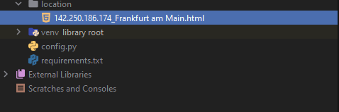
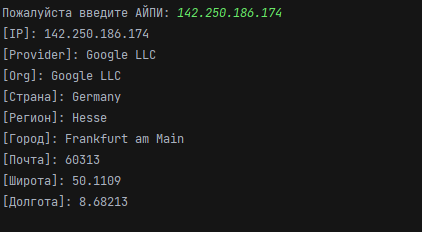

**IP INFO LOCATION**

**Author:** @ArchieWh1te

**Language:** Python 3.8

**Library pypi:** requests 2.27.1, folium 0.12.1

**License:** Free

### Скрипт который собирает информацию по IP адресу

**Описание:**

Скрипт для сбора информации по айпи адресу и вывод в терминал.

Для работы скрипта запускаем файл **config.py** далее вводим *IP adress* и получаем информацию в терминал.

В папке *location* хранится спарсиный html с картой IP адреса который мы вводим в терминале. 

### Скриншоты

**Сохранение location**

**Вывод информации в терминал**

